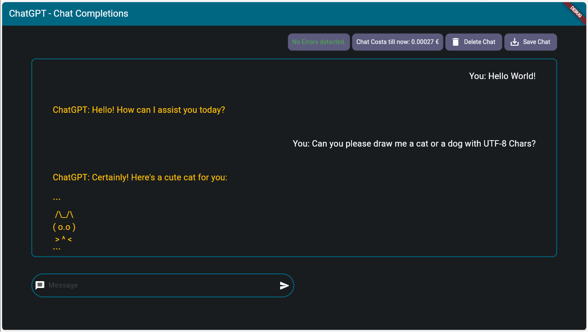
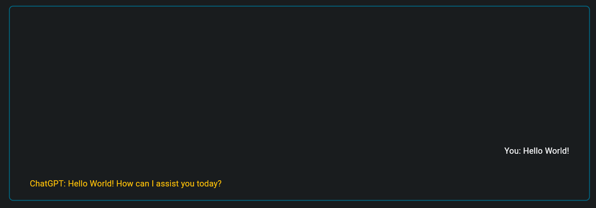
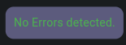

# Projekt Web-Entwicklung
Dieses Projekt entstand im Rahmen meines Studiums der Angewandten Informatik an der Fachhochschule der Wirtschaft in bergisch Gladbach (FHDW-BG).

## Inhaltsverzeichnis
1. Zusammenfassung
2. Einleitung
    - Ist-Zustand
    - die Idee
    - Ziele / Nutzen
3. Praxis
    - Umsetzung
    - Retroperspektive: Umsetzung
    - Zusätzliche Erweiterungen
4. Rekapitulation und Ausblick

## 1. Zusammenfassung
> [!NOTE] 
> Dieses Projekt stellt die Erweiterung [dieses bereits existierenden Projekts](https://github.com/csoltenborn/web_entwicklung_BFAX422A/tree/master) dar.
Meine hier entwickelte Erweiterung entstand im Rahmen meines Studiums der _Angewandten Informatik_ an der [FHDW](https://www.fhdw.de) und umfasst:

1. Serverseitig:
    - die Überarbeitung der __Server-API__ um den austausch ganzer Konversationen zu ermöglichen.
2. Clientseitig: 
    - eine umfangreiche Neugestaltung und den Ausbau der __Client-Benutzeroberfläche__ um notwendige Komponenten und Elemente, um die Konversation angemessen visualisieren zu können.
    - die Erweiterung der Geschäftslogik des Clients, um die __Konversationen__ (bestehend aus vielen Nachrichten - anstatt einzelner Nachrichten) __verarbeiten__ zu können.
    - die Erweiterung der Client-Benutzeroberfläche um eine aktuelle __Kostenanzeige__, eine __Statuszeile__, einen __Speicher-Button__ sowie die Möglichkeit, die __Konversation zurückzusetzen__.
    - die Erweiterung des Clients um eine grundlegende __Fehlerbehandlung__ und ein simples __Speicher-Konzept__, um die ausgetauschten Nachrichten mit ChatGPT zu speichern und wieder zu laden.

_Folgendes Ergebnis wird dabei erzielt:_



## 2. Einleitung
Im Rahmen des Moduls __Projekt Web-Entwicklung__ des Studiengangs __Angewandte Informatik__ an der FHDW, entstand dieses Softwareprojekt. Das Ziel dieses Projekts ist es, eine (zur Einarbeitung und Orientierung) vorgebenene Applikation zu erweitern. 
Diese wurde zusammen in den Vorlesungen des entsprechenden Kurses erarbeitet. Es handelt sich dabei um [dieses Projekt](https://github.com/csoltenborn/web_entwicklung_BFAX422A/tree/master) von [csoltenborn](github.com/csoltenborn). 
Die Aufgabe bestand zudem aus der hier angefertigten Dokumentation dieser Erweiterung.

### 2.1 Ist-Zustand
Die Vorgabe enthält zwei Kernkomponenten. Eine Client-Anwendung gebaut mithilfe des Flutter-Frameworks und eine Server Anwendung, geschrieben in Dart.  
Diese zwei Komponenten ermöglichen es, durch die Bereitstellung grundlegender Architektur, mit dem Large Language Model 3.5 (ChatGPT) von OpenAI Nachrichten bidirektional auszutauschen. D.h. dem Nutzer der Client-Anwendung ist es möglich, eine Nachricht an die API von OpenAI zu schicken und daraufhin eine entsprechende Antwort zu empfangen. Um die Architektur einfacher zu gestalten, wurde dieses [package](https://pub.dev/packages/chat_gpt_sdk) eingebunden, welches Grundfunktionalitäten der OpenAI
ChatGPT-API umfasst.

Verschickt man über die grundlegende Benutzeroberfläche eine Nachricht an das Sprachmodell, so erscheint die Antwort des Modells  binnen Sekunden in der Textbox (soweit der Server gestartet wurde). Wird erneut eine Nachricht gesendet und eine Antwort empfangen, so wird der Inhalt der Textbox in der Benutzeroberfläche durch den der Antwort ersetzt. Dadurch ist es dem Nutzer nicht
möglich, ältere Nachrichten zu Sichten. 
Des Weiteren bleiben die Nachrichten nicht über das Ende des Programms hinweg erhalten.

Stürzt das Serverprogramm aus unvorhergesehenen Gründen ab, so ist die API für den Client nicht mehr erreichbar. Nach einiger Zeit entsteht daher ein Programmfehler und die Client-Anwendung stürzt ebenfalls ab. 
Der Benutzer kann lediglich vermuten, was geschehen ist und wird mit dem direkten Absturz der Software konfrontiert, auf Kosten der User-Experience.

### 2.2 die Idee / das Konzept
Nachdem die im letzten Abschnitt beschriebenen Probleme mit der Gefahr einer verminderten User-Experience einher gehen können,
bedarf es einem Konzept, dass diese Fehler behebt:

- Um auch bereits ausgetauschte Nachrichten lesen zu können, soll eine entsprechende Komponente hinzugefügt werden, die alle aktuellen Nachrichten (Anfragen sowie Antworten) darstellt.

- Damit die gestellten Fragen und Antworten auch zur späteren Verwendung verfügbar bleiben, müssen diese persistiert werden.

- Um auch Rückfragen auf bereits gestellte Fragen oder empfangene Antworten stellen zu können, soll der gesamte Nachrichtenverlauf im Rahmen einer neuen Nachricht and das Sprachmodell mit überreicht werden.

- Um unvorhergesehenen Programmfehlern vorzubeugen, muss eine grundlegende Fehlerbehandlung implementiert werden.

- Da jede Anfrage des eigenen Servers an die API des Sprachmodells mit Kosten verbunden ist, soll jede Antwort speichern, wie viele kosten sie verursacht hat. Des Weiteren soll eine Kostenanzeige in die grafische Benutzeroberfläche integriert werden, die die bisher entstandenen Kosten des gesamten Verlaufs aufsummiert.

### 2.3 Ziele / Nutzen
Nachdem im letzten Abschnitt die Idee kurz erörtert wurde, wird in diesem Abschnitt der konkrete Nutzen festgehalten.

- Die Implementierung eines Nachrichtenverlaufs mit der Möglichkeit, ältere Nachrichten zu sichten und Rückfragen zu diesen stellen zu können, erweitert die Kernfunktionalität. Dazu zählt auch die Persistierung der Nachrichten. Dies erhöht die Verwendbarkeit der Software erheblich und bindet den Nutzer stärker ein.

- Die grundlegende Fehlerbehandlung wirkt einer schlechten User-Experience entgegen, indem der Benutzer nicht direkt mit Programmabstürzen konfrontiert wird.

- Eine Anzeige die die bisher entstandenen Kosten der Konversation visualisiert, trägt zur Transparenz der Anwendung und somit einer verbesserten User-Experience bei.

## 3. Die Erweiterung
Dieser Abschnitt beschreibt, welche technischen Änderungen und Erweiterungen vorgenommen wurden, um die Zielsetzung zu erreichen.
Zudem werden die angestellten Änderungen kurz im Rahmen der Zielsetzung bewertet. Zuletzt werden zusätzlich angefertigte, nicht im Rahmen der Zielsetzung geplante, Erweiterungen vorgestellt.

### 3.1 Umsetzung

#### Darstellen des Nachrichtenverlaufs

Um den Nachrichtenverlauf darzustellen können, wurde eine ListView verwendet. Diese staffelt Container vertikal aneinander, welche die verschiedenen Nachrichten enthalten. Diese werden abwechselnd rechts und linksbündig ausgerichtet. Somit sind alle Nachrichten, die der Nutzer eingegeben hat, rechtsbündig und alle empfangenen Antworten des Sprachmodells linksbündig. Folgender Code stellt dies vereinfacht dar.
> [!NOTE]
> Folgender Code wird stark reduziert dargestellt, um nur die Kernaspekte zu visualisieren.
```dart
ListView.builder(
    scrollDirection: Axis.vertical,
    itemCount: _messages.length,
    itemBuilder: (context, index) {

        if(index % 2==0){ _alignment = Alignment.bottomLeft; } 
        else{ _alignment = Alignment.bottomRight; }

        String message = _messages.elementAt(index).message.toString();

        return Container(
          alignment: _alignment,
          child: Text( message )
        );
    },
    ),
```
> Nach erfolgreicher Implementierung und Ausgestaltung der ListView-Komponente kann folgendes Erscheinungsbild festgehalten werden:



> [!NOTE]
> Es ist wichtig festzuhalten, dass im Code um die ListView-Komponente herum noch weitere Komponenten Verwendung finden, um das hier präsentierte Erscheinungsbild zu erreichen.

#### Nachrichtenkorrelationen herstellen und Kosten darstellen

##### Serverseitige Änderungen

Um den Bezug zwischen Nachrichten herzustellen und die entstandenen Kosten der OpenAI-API (pro Nachricht) zu speichern, muss die Server-API entsprechend angepasst und erneut generiert werden. 
_Hierbei kommt der Online-Editor von Swagger zum Einsatz. Zudem wird zur Generierung der API-Komponenten der Generator von OpenAPI verwendet._  

Folgende API-Definition lässt sich für den Aufruf der Schnittstelle festhalten:

```yaml
/chat/completion:
  post:
    tags:
      - chat
    summary: Chat completion based conversation with ChatGPT.
    operationId: chat_completion

    requestBody:
      description: Request_Body
      content:
        application/json:
          schema:
            $ref: '#/components/schemas/Chat'
      required: true

    responses:
      '200':
        description: Successful Chat completion.
        content:
          application/json:
            schema:
              $ref: '#/components/schemas/MessageAndUsage'
      '405':
        description: Invalid request.
```

Wie aus dem Abschnitt erkenntlich wird, muss bei Aufruf der API eine Chat-Entität im JSON-Format mitgegeben werden und als Antwort ist eine MessageAndUsage-Entität zu erwarten.
Folgende Definitionen wurden für die Entitäten _MessageAndUsage_ und _Chat_ verwendet.

***MessageAndUsage***

Diese Entität umfasst alle Informationen über eine bestimmte Nachricht. Sie beinhaltet wann und von wem welche Textnachricht geschickt wurde. Zudem ist ein Feld _usage_ vorhanden, in welches die entstandenen Kosten des Sprachmodells geschrieben werden können (in Tokens). Die Definition der Entität _ChatUsage_ ist am Ende dieses Abschnitts zu finden (hinter _Chat_).
```yaml
MessageAndUsage:
    type: object
    properties:
    timestamp:
        type: string
        format: date-time
    message:
        type: string
    author:
        type: string
        enum: 
        - user
        - system
        - assistant
    usage:
        $ref: '#/components/schemas/ChatUsage'
```

***Chat***

Die Entität Chat repräsentiert eine Nachrichtenanfrage an das Sprachmodell. Dementsprechend umfasst diese eine Liste aller Nachrichten, die ausgetauscht wurden. Auch ein Wert max_tokens kann mitgegeben werden. Dieser beeinflusst, wie viele Tokens das Sprachmodell zur Generierung der Antwort zur Verfügung hat.
```yaml
Chat:
    type: object
    properties:
    messages:
        type: array
        items:
        $ref: '#/components/schemas/MessageAndUsage'
    max_tokens:
        type: integer
``` 

***ChatUsage***

Die Entität ChatUsage umfasst drei Felder, in welcher das Sprachmodell vermerken kann, wie viele Tokens verwendet wurden, um die entstandene Antwort zu generieren.
```yaml
ChatUsage:
    type: object
    properties:
    prompt_tokens:
        type: number
    completion_tokens:
        type: number
    total_tokens:
        type: number
```

Mithilfe der neu genrierten OpenAPI Schnittstelle, wurde die Server-App entsprechend umgeschrieben.

##### Clientseitige Änderungen

Die geänderten und neuen Entitäten können jetzt im Anschluss an die Neugenerierung der OpenAPI genutzt werden, um die Verarbeitung auch in der Client-App zu ermöglichen. 
Beispielsweise wurde, um die Mitführung der Kosten im Rahmen der ausgetauschten Nachrichten zu ermöglichen, der Datentyp der Message-List von einer List<Message> hin zu einer List<MessageAndUsage> geändert.
Auch die Methode _setConversationCosts(double costs)_ wurde hinzugefügt und die Benutzeroberfläche entsprechend erweitert, um die Kosten anzuzeigen.
Die erstellte Komponente wird wie folgt gerendert (Beispiel anhand von tatsächlich akkumulierten Kosten):


> [!NOTE]
> Zur berechnung der Kosten wurde die Referenz des Models 3.5 0631 verwendet. Dieses Modell kostet pro 1.000.000 Tokens 2$. Dies entspricht etwa 0.93€ pro 500.000 verwendeter Tokens.

#### Nachrichtenspeicherung

Die Clientseitige Persistierung der Nachrichten wurde mithilfe der [Shared Preferences](https://pub.dev/packages/shared_preferences) des Flutter-Frameworks realisiert. Dies geschieht über die zwei statischen Methoden _saveConversation()_ und _loadConversation()_ der erstellten PrefsManager-Klasse. Diese speichern die im Programm hinterlegte Nachrichtenliste als JSON-Objekt ab. Dies geschieht mithilfe der Bibliothek __dart:convert__ und __shared_preferences/shared_preferences.dart__.

#### Fehlerbehandlung

Um entstehenden Fehlern vorzubeugen, wurde eine grundlegende Fehlerbehandlung mit Try-Catch eingebunden. Tritt ein Fehler auf, so wird die Methode _setErrorMessage()_ aufgerufen, welche dann den entsprechenden Fehlertext geregelt und angemessen visualisiert.
Diese sieht wie folgt aus:

```dart
void setErrorMessage({ColorScheme? colorScheme, String? message}){

String defaultMessage = "No Errors detected.";

_errorMessage = message ?? defaultMessage;

if(_errorMessage == defaultMessage){
    setState(() {
      _errorMessageTextStyle = const TextStyle(color: Colors.green,fontWeight: FontWeight.normal);
      _errorMessageBoxColor = colorScheme?.tertiary ?? const Color.fromARGB(255, 92, 91, 125);
    });
    return;
}
else{
    setState(() {
      _errorMessageTextStyle = TextStyle(color: colorScheme?.error ?? Colors.red, fontWeight: FontWeight.bold);
      _errorMessageBoxColor = colorScheme?.onErrorContainer ?? Colors.white;
    });
}
}
```

Wird kein Fehler registriert, so wird die Fehlerbox in der GUI wie folgt dargestellt:



Wird ein Fehler abgefangen, so wird dieser wie folgt dargestellt (_Beispielfehler_):


### 3.2 Retroperspektive: Umsetzung

Währen der Entwicklung habe ich mich aus Debugging-Zwecken auf die Ausführung im Chrome-Browser fokussiert.
Dies bringt zum einen den Vorteil, schnell und responsiv Ergebnisse erzielen zu können und Skalierungsfaktoren
(im gegensatz zu einer bspw. Handy-Version) zu erfassen und zu testen.
Allerdings bringt dies auch den Nachteil bspw. bei dier Datenspeicherungen mit den Shared Preferences. Da die 
Client-Anwendung im Debug-Moduls lediglich im Rahmen einer VM erstellt und diese auch wieder gelöscht wird,
ist das Testen der Datenspeicherung nur unter Umständen möglich und sehr aufwendig.
Des Weiteren ist es ratsam, vor den Änderungen am Backend, sich erst mit den grafischen Komponenten der
Benutzeroberfläche genauer zu beschäftigen. Dies lässt eine realistischere Umsetzung des Backends zu 
und bietet die Möglichkeit, sich erst genauer mit dem Flutter-Framework auseinanderzusetzen.

### 3.3 Zusätzliche Erweiterungen

Neben den bereits angestellten, im vorhinein geplanten, Änderungen, wurde zudem die GUI grundlegend erneuert.
Dabei erhielt sie folgende Struktur in Flutter:

```dart
  Scaffold(
    appBar: AppBar(),
    body: Container(
      child: Column(
        children: <Widget>[
          Row(
            children: [
              Container(),
              SizedBox(),
              Container(),
              SizedBox(),
              Container(),
              SizedBox(),
              Container(),
              SizedBox(),
            ]
          ),
          Container(
            child: SizedBox(
              child: RawScrollbar(
                child: ListView.builder(),
              ),
            ),
          ),
          Row(
            children:[
              SizedBox(),
            ],
          ),
          Row(
            children:<Widget>[
              SizedBox(),
              Expanded(
                child: TextFormField(),
              ),
              SizedBox(),
            ],
          ),
        ],
      ),
    ),
  );
```

Genauer auf diese Struktur und alle anderen Änderungen einzugehen, ist im Rahmen dieser Dokumentation zu Umfangreich.
Bei Nachfragen stehe ich gerne per Email zur Verfügung.

Final lässt sich folgende grafische Benutzeroberfläche festhalten:


## 4. Rekapitulation und Ausblick
