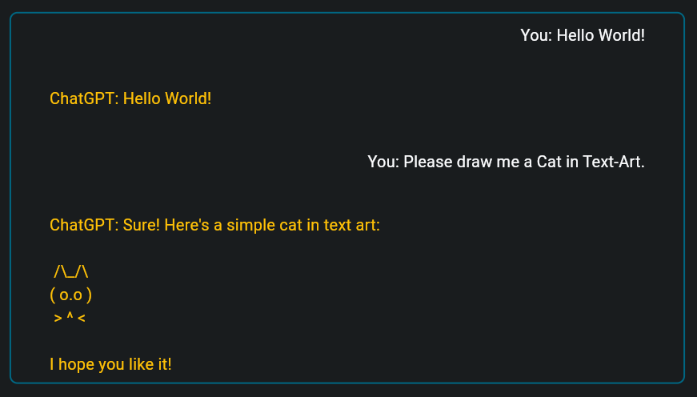

# Projekt Web-Entwicklung
Dieses Projekt entstand im Rahmen meines Studiums der Angewandten Informatik an der Fachhochschule der Wirtschaft in bergisch Gladbach (FHDW-BG).

## Inhaltsverzeichnis
1. Zusammenfassung
2. Einleitung
    - Ist-Zustand
    - die Idee
    - Ziele / Nutzen
3. Praxis
    - Umsetzung
    - Retroperspektive: Umsetzung
    - Zusätzliche Erweiterungen
4. Rekapitulation und Ausblick

## 1. Zusammenfassung
> [!NOTE] 
> Dieses Projekt stellt die Erweiterung [dieses bereits existierenden Projekts](https://github.com/csoltenborn/web_entwicklung_BFAX422A/tree/master) dar.
Meine hier entwickelte Erweiterung entstand im Rahmen meines Studiums der _Angewandten Informatik_ an der [FHDW](https://www.fhdw.de) und umfasst:
1. Serverseitig:
    - die Überarbeitung der __Server-API__ um den austausch ganzer Konversationen zu ermöglichen.
2. Clientseitig: 
    - eine umfangreiche Neugestaltung und den Ausbau der __Client-Benutzeroberfläche__ um notwendige Komponenten und Elemente, um die Konversation angemessen visualisieren zu können.
    - die Erweiterung der Geschäftslogik des Clients, um die __Konversationen__ (bestehend aus vielen Nachrichten - anstatt einzelner Nachrichten) __verarbeiten__ zu können.
    - die Erweiterung der Client-Benutzeroberfläche um eine aktuelle __Kostenanzeige__, eine __Statuszeile__, einen __Speicher-Button__ sowie die Möglichkeit, die __Konversation zurückzusetzen__.
    - die Erweiterung des Clients um eine grundlegende __Fehlerbehandlung__ und ein simples __Speicher-Konzept__, um die ausgetauschten Nachrichten mit ChatGPT zu speichern und wieder zu laden.


## 2. Einleitung
Im Rahmen des Moduls __Projekt Web-Entwicklung__ des Studiengangs __Angewandte Informatik__ an der FHDW, entstand dieses Softwareprojekt. Das Ziel dieses Projekts ist es, eine (zur Einarbeitung und Orientierung) vorgebenene Applikation zu erweitern. 
Diese wurde zusammen in den Vorlesungen des entsprechenden Kurses erarbeitet. Es handelt sich dabei um [dieses Projekt](https://github.com/csoltenborn/web_entwicklung_BFAX422A/tree/master) von [csoltenborn](github.com/csoltenborn). 
Die Aufgabe bestand zudem aus der hier angefertigten Dokumentation dieser Erweiterung.

### 2.1 Ist-Zustand
Die Vorgabe enthält zwei Kernkomponenten. Eine Client-Anwendung gebaut mithilfe des Flutter-Frameworks und eine Server Anwendung, geschrieben in Dart.  
Diese zwei Komponenten ermöglichen es, durch die Bereitstellung grundlegender Architektur, mit dem Large Language Model 3.5 (ChatGPT) von OpenAI Nachrichten bidirektional auszutauschen. D.h. dem Nutzer der Client-Anwendung ist es möglich, eine Nachricht an die API von OpenAI zu schicken und daraufhin eine entsprechende Antwort zu empfangen. Um die Architektur einfacher zu gestalten, wurde dieses [package](https://pub.dev/packages/chat_gpt_sdk) eingebunden, welches Grundfunktionalitäten der OpenAI
ChatGPT-API umfasst.

Verschickt man über die grundlegende Benutzeroberfläche eine Nachricht an das Sprachmodell, so erscheint die Antwort des Modells  binnen Sekunden in der Textbox (soweit der Server gestartet wurde). Wird erneut eine Nachricht gesendet und eine Antwort empfangen, so wird der Inhalt der Textbox in der Benutzeroberfläche durch den der Antwort ersetzt. Dadurch ist es dem Nutzer nicht
möglich, ältere Nachrichten zu Sichten. 
Des Weiteren bleiben die Nachrichten nicht über das Ende des Programms hinweg erhalten.

Stürzt das Serverprogramm aus unvorhergesehenen Gründen ab, so ist die API für den Client nicht mehr erreichbar. Nach einiger Zeit entsteht daher ein Programmfehler und die Client-Anwendung stürzt ebenfalls ab. 
Der Benutzer kann lediglich vermuten, was geschehen ist und wird mit dem direkten Absturz der Software konfrontiert, auf Kosten der User-Experience.

### 2.2 die Idee / das Konzept
Nachdem die im letzten Abschnitt beschriebenen Probleme mit der Gefahr einer verminderten User-Experience einher gehen können,
bedarf es einem Konzept, dass diese Fehler behebt:

- Um auch bereits ausgetauschte Nachrichten lesen zu können, soll eine entsprechende Komponente hinzugefügt werden, die alle aktuellen Nachrichten (Anfragen sowie Antworten) darstellt.

- Damit die gestellten Fragen und Antworten auch zur späteren Verwendung verfügbar bleiben, müssen diese persistiert werden.

- Um auch Rückfragen auf bereits gestellte Fragen oder empfangene Antworten stellen zu können, soll der gesamte Nachrichtenverlauf im Rahmen einer neuen Nachricht and das Sprachmodell mit überreicht werden.

- Um unvorhergesehenen Programmfehlern vorzubeugen, muss eine grundlegende Fehlerbehandlung implementiert werden.

- Da jede Anfrage des eigenen Servers an die API des Sprachmodells mit Kosten verbunden ist, soll jede Antwort speichern, wie viele kosten sie verursacht hat. Des Weiteren soll eine Kostenanzeige in die grafische Benutzeroberfläche integriert werden, die die bisher entstandenen Kosten des gesamten Verlaufs aufsummiert.

### 2.3 Ziele / Nutzen
Nachdem im letzten Abschnitt die Idee kurz erörtert wurde, wird in diesem Abschnitt der konkrete Nutzen festgehalten.

- Die Implementierung eines Nachrichtenverlaufs mit der Möglichkeit, ältere Nachrichten zu sichten und Rückfragen zu diesen stellen zu können, erweitert die Kernfunktionalität. Dazu zählt auch die Persistierung der Nachrichten. Dies erhöht die Verwendbarkeit der Software erheblich und bindet den Nutzer stärker ein.

- Die grundlegende Fehlerbehandlung wirkt einer schlechten User-Experience entgegen, indem der Benutzer nicht direkt mit Programmabstürzen konfrontiert wird.

- Eine Anzeige die die bisher entstandenen Kosten der Konversation visualisiert, trägt zur Transparenz der Anwendung und somit einer verbesserten User-Experience bei.

## 3. Die Erweiterung
Dieser Abschnitt beschreibt, welche technischen Änderungen und Erweiterungen vorgenommen wurden, um die Zielsetzung zu erreichen.
Zudem werden die angestellten Änderungen kurz im Rahmen der Zielsetzung bewertet. Zuletzt werden zusätzliche, nicht im Rahmen der Zielsetzung geplante Erweiterungen genannt.

### 3.1 Umsetzung

Um den Nachrichtenverlauf darzustellen können, wurde eine ListView verwendet. Diese staffelt Container vertikal aneinander, welche die verschiedenen Nachrichten enthalten. Diese werden abwechselnd nach rechts und links ausgerichtet. Somit sind alle Nachrichten, die der Nutzer abgeschickt hat, rechts orientiert und alle empfangenen Antworten links.
> [!NOTE]
> Folgender Code wird vereinfacht dargestellt, um die beschriebene Funktionalität zu visualisieren.
```dart
ListView.builder(
    scrollDirection: Axis.vertical,
    itemCount: _messages.length,
    itemBuilder: (context, index) {

        if(index%2==0){ _alignment = Alignment.bottomLeft; } 
        else{ _alignment = Alignment.bottomRight; }

        String message = _messages.elementAt(index).message.toString();

        return Container(
          alignment: _alignment,
          child: Text( message )
        );
    },
    ),
```
> Nach aufwendiger erfolgreicher Implementierung und Gestaltung der ListView-Komponente kann folgendes Erscheinungsbild festgehalten werden:



Um jetzt den Bezug zwischen Nachrichten herzustellen sowie die Kosten pro Nachricht speichern zu können, muss die Server-API entsprechend angepasst und erneut generiert werden. _Hierbei kommt der Online-Editor von Swagger zum Einsatz._ 
_Zudem wird zur Generierung der API-Komponenten der Generator von OpenAPI verwendet._  
Folgende API-Definition lässt sich festhalten:

```yaml
/chat/completion:
  post:
    tags:
      - chat
    summary: Chat completion based conversation with ChatGPT.
    operationId: chat_completion

    requestBody:
      description: Request_Body
      content:
        application/json:
          schema:
            $ref: '#/components/schemas/Chat'
      required: true

    responses:
      '200':
        description: Successful Chat completion.
        content:
          application/json:
            schema:
              $ref: '#/components/schemas/MessageAndUsage'
      '405':
        description: Invalid request.
```

Folgende Definitionen wurden für die Entitäten _MessageAndUsage_, _Chat_ und _ChatUsage_ verwendet:

***MessageAndUsage***
Diese Entität umfasst alle Informationen über eine bestimmte Nachricht. Sie beinhaltet wann und von wem was geschickt wurde. Zudem ist ein Feld _usage_ vorhanden, in welches die entstandenen Kosten des Sprachmodells geschrieben werden können (in Tokens).
```yaml
MessageAndUsage:
    type: object
    properties:
    timestamp:
        type: string
        format: date-time
    message:
        type: string
    author:
        type: string
        enum: 
        - user
        - system
        - assistant
    usage:
        $ref: '#/components/schemas/ChatUsage'
```

***Chat***
Die Entität Chat repräsentiert eine Nachrichtenanfrage an das Sprachmodell. Dementsprechend umfasst diese eine Liste aller Nachrichten, die ausgetauscht wurden. Auch ein Wert max_tokens kann mitgegeben werden. Dieser beeinflusst, wie viele Tokens das Sprachmodell zur Generierung der Antwort zur Verfügung hat.
```yaml
Chat:
    type: object
    properties:
    messages:
        type: array
        items:
        $ref: '#/components/schemas/MessageAndUsage'
    max_tokens:
        type: integer
``` 

***ChatUsage***
Die Entität ChatUsage umfasst drei Felder, in welcher das Sprachmodell vermerken kann, wie viele Tokens verwendet wurden, um die entstandene Antwort zu generieren.
```yaml
ChatUsage:
    type: object
    properties:
    prompt_tokens:
        type: number
    completion_tokens:
        type: number
    total_tokens:
        type: number
```

Die Clientseitige Persistierung der Nachrichten wurde mithilfe der ([Shared Preferences](https://pub.dev/packages/shared_preferences)) realisiert. Dies geschieht über die zwei statischen Methoden saveConversation() und loadConversation()
der selbst erstellten PrefsManager-Klasse. Diese speichern die im Programm hinterlegte Nachrichtenliste als JSON-Objekt ab. Dies geschieht mithilfe der Bibliothek __dart:convert__ und __shared_preferences/shared_preferences.dart__.

### 3.2 Retroperspektive: Umsetzung

### 3.3 Zusätzliche Erweiterungen

## 4. Rekapitulation und Ausblick
